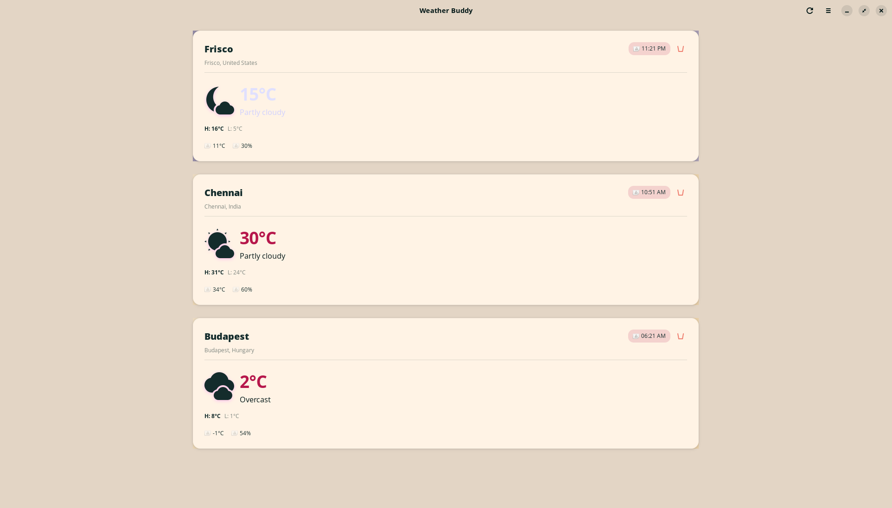

# Weather Buddy

[](https://www.gnu.org/licenses/gpl-3.0)
[](https://www.python.org/downloads/)
[](https://gtk.org/)
[](https://gnome.pages.gitlab.gnome.org/libadwaita/)

A beautiful, modern weather application for **GNOME** and **COSMIC** desktops. Track weather, time, and temperature for multiple locations with an adaptive, visually stunning interface.

Perfect for remote workers who want to quickly check the weather conditions of their colleagues before conference calls - great for making small talk and building connections!



## Features

- **Multi-location support** - Track weather for unlimited locations
- **Real-time updates** - Automatic weather refresh at configurable intervals (1-60 minutes)
- **Beautiful UI** - Modern libadwaita design that adapts to light/dark themes
- **Time-aware styling** - Cards change appearance based on local time (morning/afternoon/evening/night)
- **Detailed weather info**:
  - Current temperature with high/low
  - Feels-like temperature
  - Humidity percentage
  - Wind speed
  - Weather conditions with intuitive icons
- **No API key required** - Uses Open-Meteo's free, open-source weather API
- **Privacy focused** - All configuration stored locally, no telemetry

## Screenshots

| Light Mode | Dark Mode |
|------------|-----------|
|  |  |

## Requirements

- **Python** 3.10 or higher
- **GTK** 4.0
- **libadwaita** 1.0
- **PyGObject**

### System Dependencies

**Ubuntu/Debian:**
```bash
sudo apt install python3-gi python3-gi-cairo gir1.2-gtk-4.0 gir1.2-adw-1
```

**Fedora:**
```bash
sudo dnf install python3-gobject gtk4 libadwaita
```

**Arch Linux:**
```bash
sudo pacman -S python-gobject gtk4 libadwaita
```

**openSUSE:**
```bash
sudo zypper install python3-gobject gtk4 libadwaita
```

## Installation

### Quick Install (Recommended)

```bash
# Clone the repository
git clone https://github.com/mgrvik/Cosmic-Time-Weather.git
cd Cosmic-Time-Weather

# Run the installation script
chmod +x install.sh
./install.sh
```

### Manual Install

```bash
# Clone the repository
git clone https://github.com/mgrvik/Cosmic-Time-Weather.git
cd Cosmic-Time-Weather

# Create virtual environment (recommended)
python3 -m venv venv
source venv/bin/activate

# Install Python dependencies
pip install -r requirements.txt
```

## Running

**From terminal:**
```bash
cd Cosmic-Time-Weather
python3 -m src.main
```

**After installation:**
```bash
weather-buddy
```

**From desktop:**
Search for "Weather Buddy" in your applications menu.

## Configuration

Click the menu button (☰) and select **Settings** to configure:

| Setting | Description |
|---------|-------------|
| **Locations** | Search and add unlimited cities with custom contact names |
| **Temperature Unit** | Celsius or Fahrenheit |
| **Update Interval** | How often to refresh weather (60-3600 seconds) |
| **Weather Details** | Toggle visibility of feels-like, humidity, and wind |

Configuration is stored in `~/.config/weather-buddy/config.json`.

## Development

### Project Structure

```
weather-buddy/
├── src/
│   ├── main.py                 # Application entry point
│   ├── ui/
│   │   ├── main_window.py      # Main application window
│   │   ├── location_card.py    # Weather card widget
│   │   └── settings_dialog.py  # Settings window
│   └── services/
│       ├── weather_api.py      # Open-Meteo API client
│       ├── config.py           # Configuration management
│       └── async_utils.py      # Async helpers
├── pyproject.toml              # Project metadata
├── requirements.txt            # Python dependencies
├── install.sh                  # Installation script
└── README.md
```

### Running Tests

```bash
python3 -m pytest tests/
```

### Code Style

This project follows:
- **Black** for code formatting (line length: 100)
- **Pylint** for linting
- **MyPy** for type checking

```bash
# Format code
black src/

# Lint
pylint src/

# Type check
mypy src/
```

## API

Weather Buddy uses the [Open-Meteo API](https://open-meteo.com/):

- Free to use, no API key required
- No rate limits for personal use
- Open data from national weather services
- Attribution: Data from NOAA, DWD, MeteoFrance, and other national weather services

## Contributing

Contributions are welcome! Here's how to help:

1. Fork the repository
2. Create a feature branch (`git checkout -b feature/amazing-feature`)
3. Commit your changes (`git commit -m 'Add amazing feature'`)
4. Push to the branch (`git push origin feature/amazing-feature`)
5. Open a Pull Request

Please make sure to update tests as appropriate and follow the existing code style.

## Roadmap

- [ ] Weather alerts/notifications
- [ ] 7-day forecast view
- [ ] Location groups/categories
- [ ] Custom themes
- [ ] COSMIC desktop native port

## License

This project is licensed under the GNU General Public License v3.0 or later - see the [LICENSE](LICENSE) file for details.

## Acknowledgments

- Weather data provided by [Open-Meteo](https://open-meteo.com/)
- Icons from the GNOME icon theme
- Built with [GTK4](https://gtk.org/) and [libadwaita](https://gnome.pages.gitlab.gnome.org/libadwaita/)

---

Made with love for the Linux desktop community
